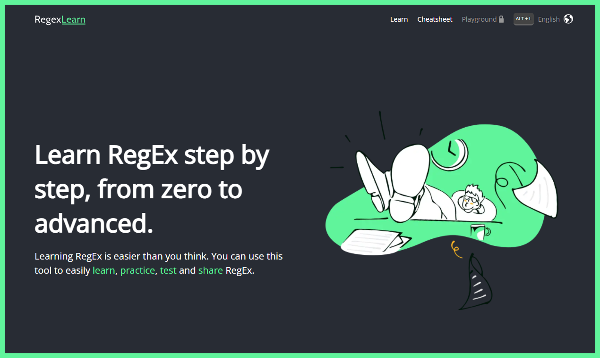
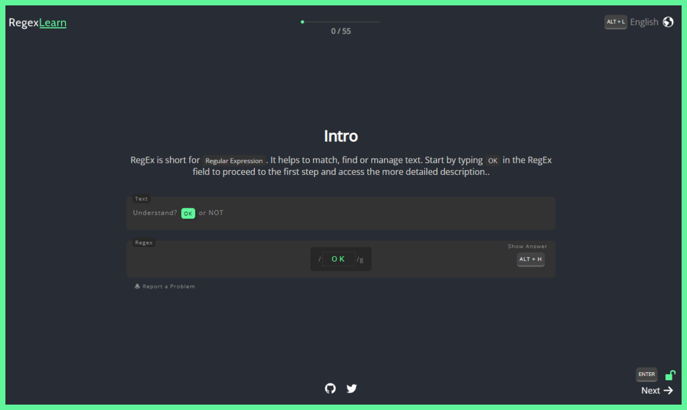
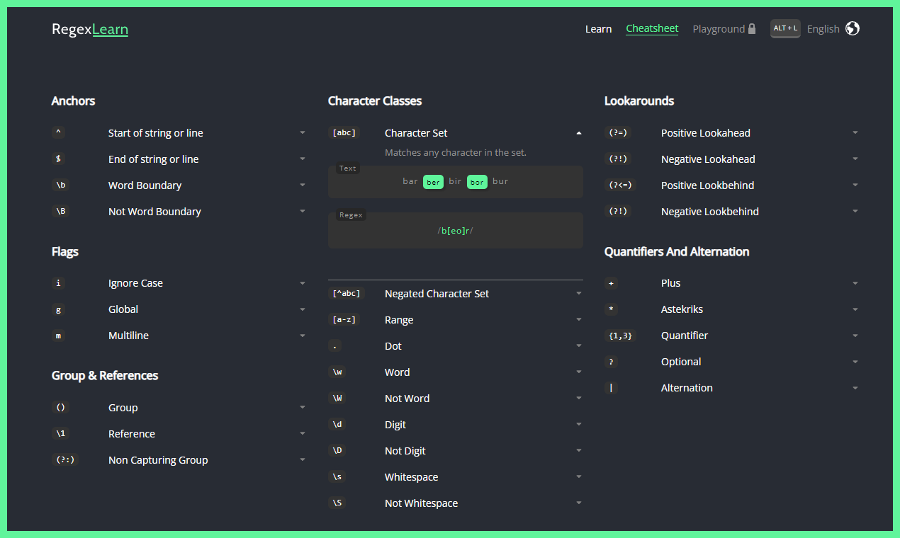

# [regexlearn.com](https://regexlearn.com)

This is a project that makes learning how to write regex easy.

## Features

- **Step by Step Learn**
- **Interactive**
- **Shortcut Friendly**
- **Cheatsheet**
- Practice _(Soon)_
- Playground _(Soon)_

## Available Languages

- **English**
- **Turkish**
- **Russian**
- **Spanish**
- **Chinese**
- _Korean_ [(Requested)](https://github.com/aykutkardas/regexlearn.com/issues/92)
- _Brazilian Portuguese_ [(Requested)](https://github.com/aykutkardas/regexlearn.com/issues/39)

_Please create an issue to add your own language._

 

<h2 align="center">Our Sponsors</h2>

  
  

<h2 align="center">Sponsoring</h2>

This project is developed as open-source in our spare time. <a href="mailto:aykutkrds@gmail.com">Contact</a> to support and appear as a sponsor.

<h4 align="center">🎉<a href="https://www.patreon.com/bePatron?u=65063346" data-patreon-widget-type="become-patron-button">Become a Patron!</a>🎉</h3>

 

<h2 align="center">Preview</h2>

 

 
