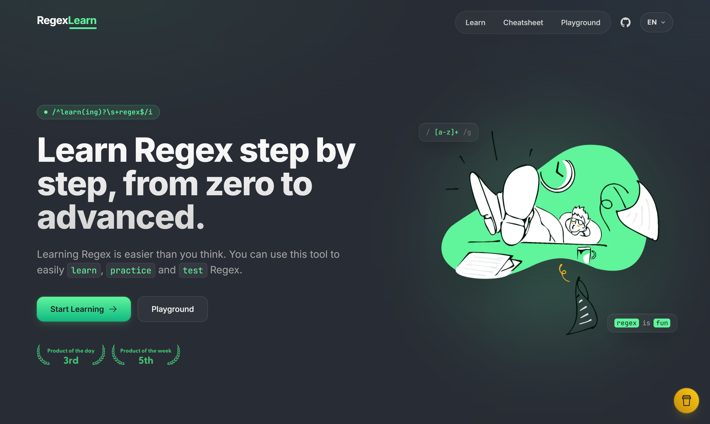
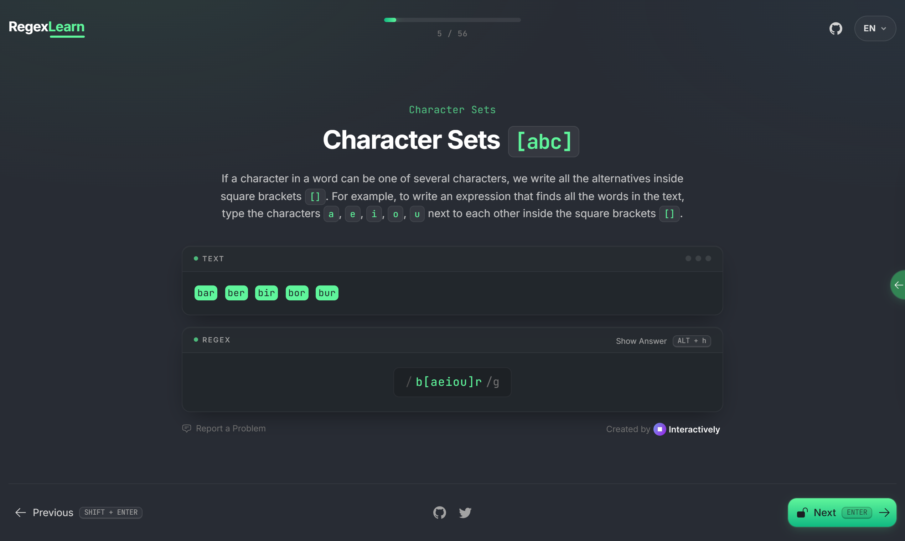
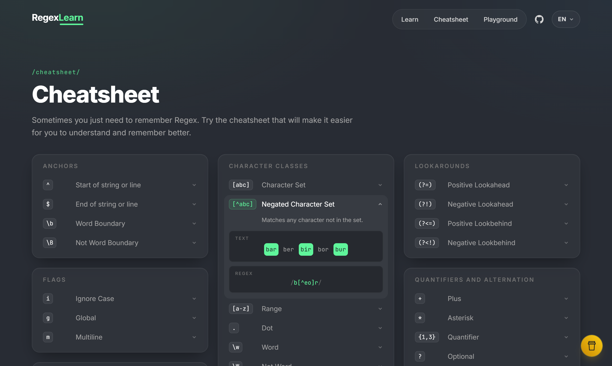
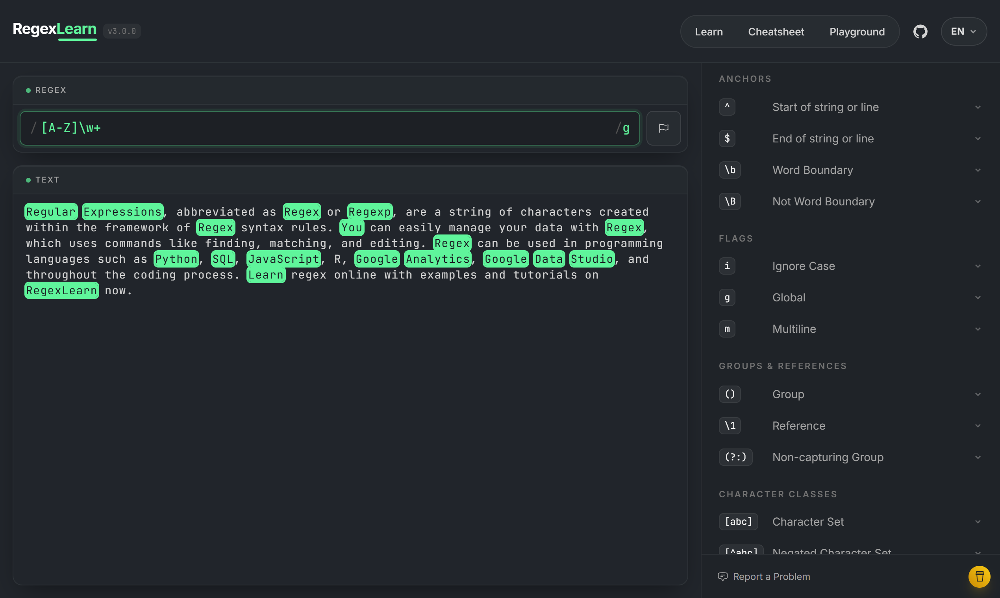

# RegexLearn

[](https://github.com/aykutkardas/regexlearn.com/releases)
[](LICENCE)
[](https://github.com/aykutkardas/regexlearn.com/stargazers)

**[regexlearn.com](https://regexlearn.com/)** is a free, open-source platform that turns regular
expressions from a black art into a skill you can pick up in an afternoon. Learn step by step in 21
languages, keep the cheatsheet nearby, and test your patterns live in the playground.



## Features

- **Step-by-Step Learning:** Interactive lessons that progress from the basics to advanced
  patterns, one small step at a time. Matches light up as you type, and your progress is saved in
  your browser.
- **Courses:** Two lesson tracks are available: [Regex 101](https://regexlearn.com/learn/regex101)
  for fundamentals and [Regex for SEO](https://regexlearn.com/learn/regex-for-seo) for practical,
  search-focused usage.
- **Cheatsheet:** A concise summary of regex syntax with a live example for every entry.
- **Playground:** A private, browser-based sandbox to write and test regex patterns. Everything
  runs locally; nothing you type is sent to a server.
- **Shortcut Friendly:** Move through lessons, toggle flags, and reveal answers from the keyboard.
- **Works Everywhere:** Responsive on phones and tablets, with right-to-left support for Arabic and
  Persian.

<table>
  <tr>
    <td width="33%"></td>
    <td width="33%"></td>
    <td width="33%"></td>
  </tr>
  <tr>
    <td align="center">Learn</td>
    <td align="center">Cheatsheet</td>
    <td align="center">Playground</td>
  </tr>
</table>

## Supported Languages

Available in 21 languages:

<table>
  <tbody>
    <tr><td>🇺🇸 English</td><td>🇹🇷 Turkish</td><td>🇷🇺 Russian</td></tr>
    <tr><td>🇪🇸 Spanish</td><td>🇨🇳 Chinese (Simplified)</td><td>🇹🇼 Chinese (Traditional)</td></tr>
    <tr><td>🇩🇪 German</td><td>🇺🇦 Ukrainian</td><td>🇫🇷 French</td></tr>
    <tr><td>🇵🇱 Polish</td><td>🇰🇷 Korean</td><td>🇧🇷 Brazilian Portuguese</td></tr>
    <tr><td>🇨🇿 Czech</td><td>🇬🇪 Georgian</td><td>🇮🇷 Persian</td></tr>
    <tr><td>🇮🇹 Italian</td><td>🇸🇦 Arabic</td><td>🇧🇩 Bengali</td></tr>
    <tr><td>🇯🇵 Japanese</td><td>🇮🇩 Indonesian</td><td>🇻🇳 Vietnamese</td></tr>
  </tbody>
</table>

Speak a language that isn't listed? Adding it is a single pull request: copy the
[`en`](src/localization/en) folder in [`src/localization/`](src/localization), translate the JSON
files, and you've brought regex to every developer who reads in your language. Prefer to start a
conversation first?
**[Open an issue](https://github.com/aykutkardas/regexlearn.com/issues/new)**.

### Translation Guidelines

- **English is the reference.** Translate from [`src/localization/en`](src/localization/en) and keep
  exactly the same keys in every file.
- **Leave code as it is.** Text between backticks (`` `[a-z]` ``, `` `OK` ``) is rendered as code;
  don't translate it, and keep every pair of backticks.
- **Keep the line breaks.** `\n` marks a line break inside a lesson text; keep it in the same place.
- **Match the lesson.** Each step asks the learner to type a specific answer, so a translated
  instruction must still lead to that exact answer.

## Development

Built with [Next.js](https://nextjs.org/), [React](https://react.dev/),
[TypeScript](https://www.typescriptlang.org/), and [Tailwind CSS](https://tailwindcss.com/). The
site is exported as static HTML.

Requires Node.js 20.9 or newer (the pinned version is in [`.node-version`](.node-version)).

```bash
npm install   # install dependencies
npm run dev   # start the dev server at http://localhost:3003
npm run lint  # lint the project
npm run build # static production build in out/
```

Local environment variables belong in `.env` or one of Next.js's `.env.*.local` files. These files
are ignored by Git and must not contain values intended for source control.

## Contributing

RegexLearn is shaped by its community: lessons, translations, and fixes in this repo came from
contributors around the world. Spotted a typo, a bug, or an awkward translation? A small pull
request is all it takes to improve the experience for thousands of learners.

- Please target the **`develop`** branch with your pull requests. It is the default branch and the
  integration branch for upcoming releases.
- The `main` branch is production: every commit on it is deployed to
  [regexlearn.com](https://regexlearn.com/) automatically, so it only moves on releases.

## Our Sponsors

[](https://ahrefs.com/) [](https://wope.com)

## Sponsorship

RegexLearn is free for everyone, and sponsors are what keep it that way. Sponsorship puts your
brand in front of a worldwide audience of developers at the exact moment they're learning. Want
your logo up there? **[Get in touch](mailto:aykutkrds@gmail.com)**.

## License

This project is licensed under the MIT License. See the [LICENCE](LICENCE) file for details.
